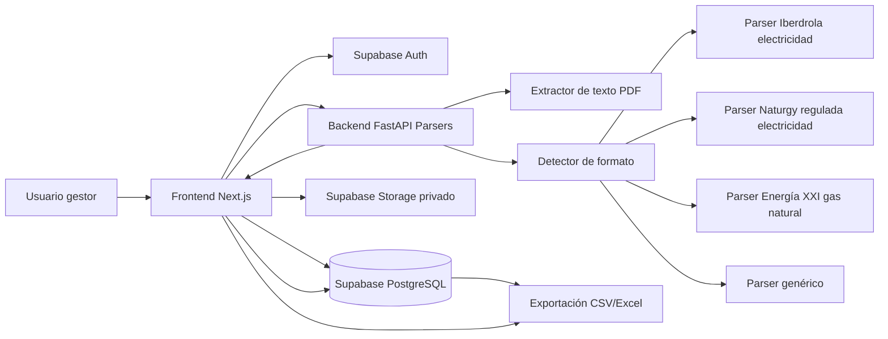
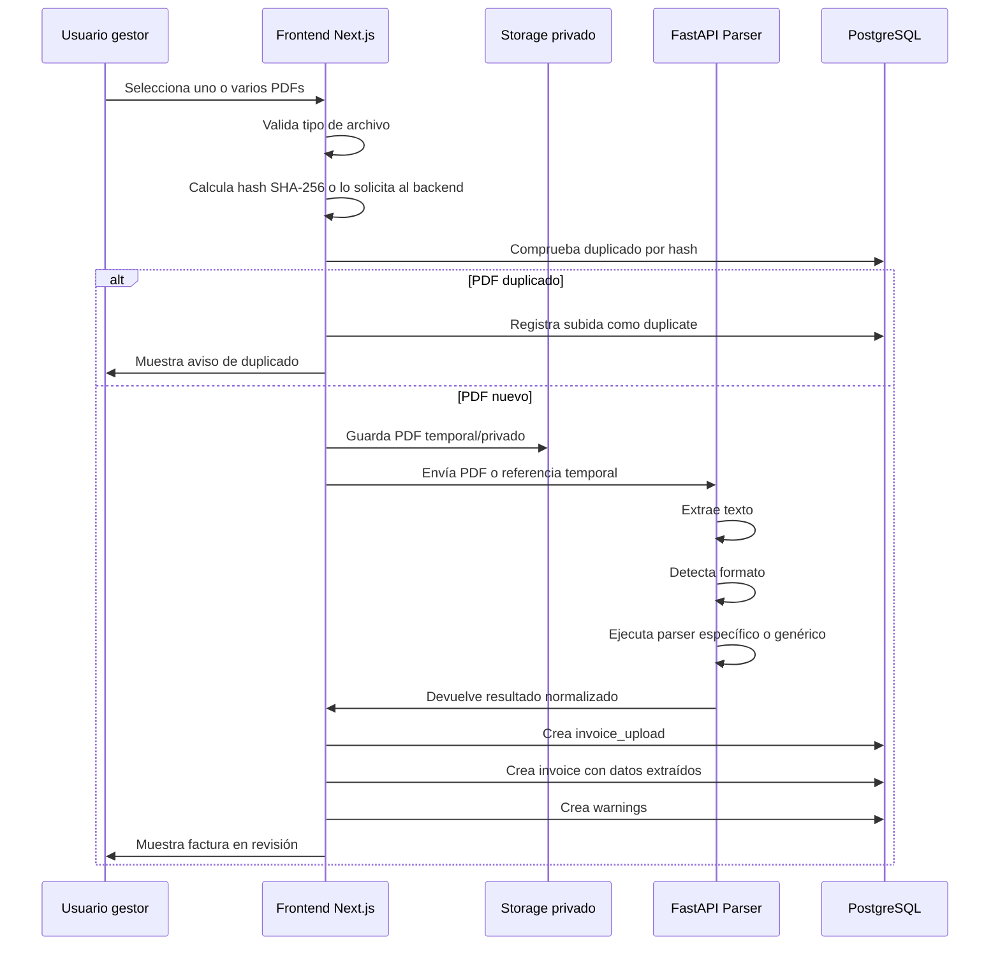
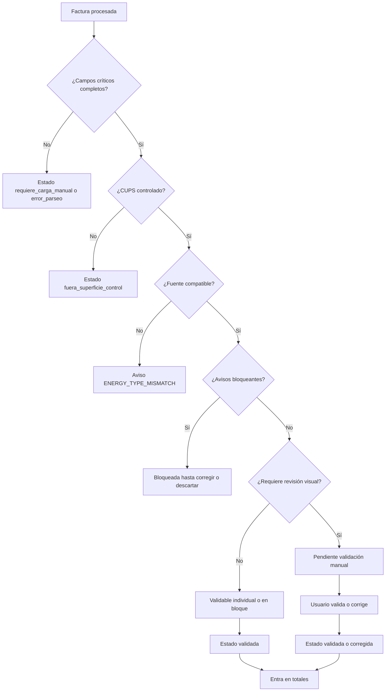
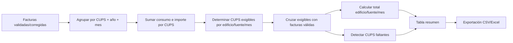

# Arquitectura técnica

## 1. Propósito del documento

Este documento define la arquitectura técnica propuesta para el MVP de la aplicación auxiliar de preparación de datos energéticos destinados a carga manual en SIGEE-AGE.

Su finalidad es establecer una base técnica clara para implementar la prueba de concepto, separando responsabilidades entre interfaz, base de datos, lógica de negocio y parsers de facturas.

Este documento debe servir como referencia para:

* diseño técnico;
* implementación con OpenCode;
* organización del repositorio;
* decisiones de infraestructura;
* despliegue del MVP;
* evolución posterior del sistema.

## 2. Principios de arquitectura

La arquitectura del MVP debe seguir estos principios:

* simplicidad operativa;
* separación clara entre frontend, backend de aplicación y backend de parseo;
* parsers desacoplados de la base de datos;
* CUPS como eje de asociación entre factura y edificio;
* conservación mínima de datos necesarios;
* posibilidad de borrar PDFs tras validación;
* facilidad para añadir nuevos parsers;
* trazabilidad suficiente sin sobredimensionar auditoría;
* despliegue sencillo;
* seguridad básica desde el inicio.

## 3. Visión general

La solución se plantea como una aplicación web con los siguientes bloques:

| Bloque                 | Responsabilidad                                                                      |
| ---------------------- | ------------------------------------------------------------------------------------ |
| Frontend web           | Interfaz de usuario, revisión, validación, consulta y exportación                    |
| Supabase Auth          | Autenticación email/contraseña                                                       |
| Supabase PostgreSQL    | Persistencia de edificios, CUPS, facturas, avisos y auditoría                        |
| Supabase Storage       | Almacenamiento temporal o privado de PDFs si se decide conservarlos durante revisión |
| Backend parser FastAPI | Extracción de texto, detección de formato y ejecución de parsers                     |
| Servicios de negocio   | Validación, asociación con CUPS, cálculo de estados y totales                        |
| Exportador             | Generación de CSV y Excel                                                            |

## 4. Arquitectura recomendada



## 5. Stack tecnológico propuesto

### 5.1 Frontend

Tecnología recomendada:

* Next.js;
* TypeScript;
* React;
* Tailwind CSS;
* cliente Supabase para autenticación y operaciones básicas;
* librería de tablas para filtros y revisión si se considera necesario.

Responsabilidades principales:

* login y sesión;
* navegación principal;
* carga de PDFs;
* revisión de facturas;
* corrección manual;
* validación individual y en bloque;
* consulta de edificios y CUPS;
* consulta de totales;
* exportación;
* visualización del PDF durante revisión si está disponible.

### 5.2 Base de datos

Tecnología recomendada:

* PostgreSQL gestionado por Supabase.

Responsabilidades principales:

* usuarios autenticados mediante Supabase Auth;
* edificios;
* tipos de energía;
* CUPS controlados;
* registros técnicos de subida;
* facturas procesadas;
* avisos;
* auditoría básica;
* cálculo o soporte de consulta de totales.

### 5.3 Backend de parseo

Tecnología recomendada:

* Python;
* FastAPI;
* Pydantic;
* PyMuPDF o pdfplumber;
* Decimal para importes y consumos;
* pytest para tests.

Responsabilidades principales:

* recibir un PDF o referencia temporal;
* calcular o recibir hash si procede;
* extraer texto;
* detectar formato;
* ejecutar parser específico o genérico;
* devolver resultado normalizado;
* no escribir directamente en base de datos salvo decisión posterior;
* no decidir reglas de negocio que correspondan a la capa de aplicación.

### 5.4 Almacenamiento de PDFs

Criterio MVP:

* almacenamiento temporal o privado;
* no exposición pública;
* posibilidad de eliminar tras validación;
* conservación de metadatos y datos estructurados aunque se elimine el archivo.

Opciones:

| Opción                              | Uso recomendado                                                         |
| ----------------------------------- | ----------------------------------------------------------------------- |
| Supabase Storage privado            | Si el frontend necesita mostrar PDF durante revisión                    |
| almacenamiento temporal backend     | Si el PDF solo se usa durante parseo                                    |
| no conservación del PDF tras parseo | Cuando los datos ya estén validados y no se requiera revisión posterior |

## 6. Separación de responsabilidades

### 6.1 Frontend

El frontend debe encargarse de:

* experiencia de usuario;
* validaciones ligeras de formulario;
* presentación de datos;
* llamadas a servicios;
* acciones de usuario.

No debe encargarse de:

* parsear PDFs;
* calcular reglas complejas de completitud si pueden estar en backend o base de datos;
* guardar secretos;
* exponer rutas públicas de PDFs.

### 6.2 Backend parser

El backend parser debe encargarse de:

* leer PDFs;
* extraer texto;
* ejecutar parsers;
* devolver datos normalizados;
* generar avisos técnicos de extracción.

No debe encargarse de:

* decidir si una factura entra en totales;
* validar la superficie de control contra base de datos;
* calcular completitud mensual;
* gestionar usuarios;
* modificar SIGEE-AGE.

### 6.3 Capa de negocio

La capa de negocio debe encargarse de:

* comprobar CUPS contra superficie de control;
* asociar factura a edificio;
* comprobar compatibilidad de fuente energética;
* detectar duplicados;
* asignar estado inicial;
* decidir si requiere revisión visual;
* permitir o bloquear validación;
* calcular totales y completitud;
* generar avisos funcionales.

En el MVP esta capa puede implementarse parcialmente en servicios del frontend/backend web y parcialmente en consultas SQL, pero las reglas deben estar centralizadas y no duplicadas de forma incoherente.

## 7. Flujo técnico de carga y procesamiento



## 8. Flujo técnico de validación



## 9. Flujo técnico de cálculo de totales



## 10. Módulos funcionales de la aplicación

### 10.1 Autenticación

Responsabilidades:

* login;
* logout;
* protección de rutas;
* gestión de sesión.

Tablas relacionadas:

* `auth.users` de Supabase;
* `users` si se crea tabla auxiliar de perfil.

### 10.2 Edificios y CUPS

Responsabilidades:

* listar edificios;
* consultar detalle de edificio;
* listar CUPS controlados;
* alta de CUPS;
* baja de CUPS;
* edición limitada.

Tablas relacionadas:

* `buildings`;
* `energy_types`;
* `controlled_cups`;
* `audit_events`.

### 10.3 Facturas

Responsabilidades:

* subida de PDFs;
* registro técnico;
* parseo;
* revisión;
* corrección;
* validación;
* descarte;
* detección de duplicados.

Tablas relacionadas:

* `invoice_uploads`;
* `invoices`;
* `invoice_warnings`;
* `controlled_cups`;
* `buildings`;
* `audit_events`.

### 10.4 Totales

Responsabilidades:

* cálculo de totales por CUPS;
* cálculo de totales por edificio, fuente, año y mes;
* detección de completitud;
* listado de CUPS faltantes.

Tablas relacionadas:

* `invoices`;
* `controlled_cups`;
* `buildings`;
* vista o servicio `monthly_totals`.

### 10.5 Exportaciones

Responsabilidades:

* exportación resumen CSV;
* exportación resumen Excel;
* exportación detalle si se implementa en MVP;
* registro de evento de exportación.

## 11. Organización recomendada del repositorio

```txt
sigee-age-aux/
├── README.md
├── docs/
│   ├── 00_resumen_ejecutivo.md
│   ├── 01_contexto_y_objetivo.md
│   ├── 02_alcance_mvp.md
│   ├── 03_requisitos_funcionales.md
│   ├── 04_reglas_negocio.md
│   ├── 05_modelo_datos.md
│   ├── 06_arquitectura_tecnica.md
│   ├── 07_pantallas_y_flujos.md
│   ├── 08_parsers_facturas.md
│   ├── 09_validaciones_y_avisos.md
│   ├── 10_exportaciones.md
│   ├── 11_plan_implementacion_opencode.md
│   └── 12_glosario.md
├── frontend/
│   ├── app/
│   ├── components/
│   ├── features/
│   ├── lib/
│   ├── services/
│   ├── types/
│   └── tests/
├── backend/
│   ├── app/
│   │   ├── main.py
│   │   ├── api/
│   │   ├── parsers/
│   │   ├── services/
│   │   └── schemas/
│   └── tests/
├── supabase/
│   ├── migrations/
│   ├── seed/
│   └── policies/
├── data/
│   └── seed/
├── examples/
│   └── facturas/
├── diagrams/
└── opencode/
```

## 12. Estructura recomendada del frontend

```txt
frontend/
├── app/
│   ├── login/
│   ├── dashboard/
│   ├── edificios/
│   ├── cups/
│   ├── facturas/
│   ├── revision/
│   ├── totales/
│   └── exportaciones/
├── components/
│   ├── ui/
│   ├── layout/
│   ├── tables/
│   └── forms/
├── features/
│   ├── auth/
│   ├── buildings/
│   ├── cups/
│   ├── invoices/
│   ├── totals/
│   └── exports/
├── lib/
│   ├── supabase-client.ts
│   ├── constants.ts
│   └── formatters.ts
├── services/
│   ├── invoice-service.ts
│   ├── cups-service.ts
│   ├── totals-service.ts
│   └── export-service.ts
└── types/
    ├── database.ts
    ├── invoices.ts
    └── totals.ts
```

## 13. Estructura recomendada del backend parser

```txt
backend/
├── app/
│   ├── main.py
│   ├── api/
│   │   ├── health.py
│   │   └── parse_invoice.py
│   ├── parsers/
│   │   ├── __init__.py
│   │   ├── base.py
│   │   ├── detector.py
│   │   ├── generic.py
│   │   ├── iberdrola_electricidad.py
│   │   ├── naturgy_regulada_electricidad.py
│   │   └── energia_xxi_gas_natural.py
│   ├── services/
│   │   ├── pdf_text_extractor.py
│   │   ├── cups_normalizer.py
│   │   ├── number_parser.py
│   │   ├── date_parser.py
│   │   └── hashing.py
│   └── schemas/
│       └── invoices.py
└── tests/
    ├── parsers/
    │   ├── test_iberdrola_electricidad.py
    │   ├── test_naturgy_regulada_electricidad.py
    │   └── test_energia_xxi_gas_natural.py
    └── services/
        ├── test_cups_normalizer.py
        ├── test_number_parser.py
        └── test_date_parser.py
```

## 14. API propuesta del backend parser

### 14.1 Health check

```txt
GET /health
```

Respuesta:

```json
{
  "status": "ok"
}
```

### 14.2 Parsear factura

```txt
POST /parse-invoice
```

Entrada recomendada:

* multipart con archivo PDF; o
* referencia temporal al archivo si el backend tiene acceso a Storage.

Respuesta recomendada:

```json
{
  "parser_name": "iberdrola_electricidad",
  "parser_version": "1.0.0",
  "parse_source": "parser_especifico",
  "parse_confidence": 0.98,
  "energy_type": "electricidad",
  "supplier_name": "Iberdrola Clientes, S.A.U.",
  "invoice_number": "21250131040000158",
  "cups_original": "ES 0022 0000 0621 2876 CB",
  "cups_key": "ES0022000006212876CB",
  "period_start": "2024-12-10",
  "period_end": "2025-01-15",
  "computed_year": 2025,
  "computed_month": 1,
  "consumption_kwh": "88",
  "total_amount_eur": "23.70",
  "raw_candidates": {},
  "warnings": []
}
```

## 15. Servicios internos recomendados

### 15.1 `cups_normalizer`

Responsabilidad:

* normalizar CUPS;
* aplicar reglas de equivalencia de sufijos;
* ofrecer una única función reutilizable para parsers y capa de negocio.

Función esperada:

```python
def normalize_cups(cups_original: str) -> str:
    ...
```

### 15.2 `number_parser`

Responsabilidad:

* convertir importes y consumos desde formato español a Decimal.

Ejemplos:

| Entrada     | Salida     |
| ----------- | ---------- |
| `7,80`      | `7.80`     |
| `1.234,56`  | `1234.56`  |
| `8.650,000` | `8650.000` |

### 15.3 `date_parser`

Responsabilidad:

* convertir fechas en formato numérico, español o catalán/valenciano a `date`.

Ejemplos:

| Entrada                        | Salida                      |
| ------------------------------ | --------------------------- |
| `15/01/2025`                   | `2025-01-15`                |
| `20 de agosto de 2025`         | `2025-08-20`                |
| `del 23/12/2024 al 27/02/2025` | `2024-12-23` y `2025-02-27` |

### 15.4 `pdf_text_extractor`

Responsabilidad:

* extraer texto de PDF;
* detectar PDF sin texto suficiente;
* devolver texto y metadatos básicos.

### 15.5 `parser_detector`

Responsabilidad:

* analizar marcadores;
* decidir parser específico;
* fallback a parser genérico.

## 16. Modelo de datos técnico

El modelo de datos se define en detalle en `05_modelo_datos.md`.

Tablas principales:

* `energy_types`;
* `buildings`;
* `controlled_cups`;
* `invoice_uploads`;
* `invoices`;
* `invoice_warnings`;
* `audit_events`.

Vista o cálculo:

* `monthly_totals` o cálculo bajo demanda.

## 17. Estrategia de cálculo de totales

Para el MVP se recomienda comenzar con cálculo bajo demanda en backend o servicio de aplicación.

Ventajas:

* mayor claridad;
* facilidad para depurar reglas;
* evita materializar datos prematuramente;
* permite evolucionar sin migraciones complejas.

Alternativas futuras:

* vista SQL;
* vista materializada;
* tabla de totales recalculada tras cada validación.

Criterio inicial:

```txt
Solo se calculan totales usando facturas con estado validada o corregida.
```

## 18. Estrategia de exportación

La exportación puede implementarse inicialmente desde el frontend o desde un endpoint backend.

### 18.1 CSV

Puede generarse en frontend si los datos ya están cargados y filtrados.

Debe respetar:

* filtros aplicados;
* columnas visibles o definidas;
* formato numérico consistente;
* aviso de completitud.

### 18.2 Excel

Puede generarse mediante una librería de JavaScript en frontend o mediante backend.

Recomendación inicial:

* usar generación desde frontend si el volumen es bajo;
* pasar a backend si se necesitan formatos avanzados o grandes volúmenes.

## 19. Seguridad técnica mínima

### 19.1 Autenticación

* uso de Supabase Auth;
* rutas protegidas;
* sesión obligatoria para pantallas internas.

### 19.2 Base de datos

Recomendaciones:

* activar Row Level Security si se usa Supabase directamente desde frontend;
* crear políticas mínimas para usuario autenticado;
* evitar permisos anónimos sobre tablas internas;
* no exponer claves de servicio en frontend.

### 19.3 Storage

Recomendaciones:

* bucket privado;
* no usar URLs públicas permanentes;
* generar URLs temporales solo para usuario autenticado;
* borrar PDF cuando ya no sea necesario.

### 19.4 Logs

No deben registrarse:

* PDFs completos;
* texto completo de facturas en producción;
* secretos;
* tokens;
* datos innecesarios.

## 20. Variables de entorno recomendadas

### 20.1 Frontend

```txt
NEXT_PUBLIC_SUPABASE_URL=
NEXT_PUBLIC_SUPABASE_ANON_KEY=
NEXT_PUBLIC_PARSER_API_URL=
```

### 20.2 Backend parser

```txt
PARSER_ENV=development
MAX_UPLOAD_SIZE_MB=20
ALLOWED_ORIGINS=http://localhost:3000
```

Si el backend accede a Supabase Storage o DB directamente:

```txt
SUPABASE_URL=
SUPABASE_SERVICE_ROLE_KEY=
```

La clave `SUPABASE_SERVICE_ROLE_KEY` nunca debe exponerse en frontend.

## 21. Despliegue recomendado

### 21.1 Frontend

Opción recomendada:

* Vercel.

Motivos:

* integración sencilla con Next.js;
* despliegue rápido;
* variables de entorno;
* preview deployments útiles para pruebas.

### 21.2 Base de datos y autenticación

Opción recomendada:

* Supabase.

Motivos:

* PostgreSQL gestionado;
* Auth integrado;
* Storage privado;
* migraciones SQL;
* panel de administración.

### 21.3 Backend parser

Opciones posibles:

* Render;
* Railway;
* Fly.io;
* servicio propio;
* contenedor Docker.

Requisitos:

* soporte Python;
* límites de subida compatibles con PDFs;
* variables de entorno;
* CORS configurado para frontend;
* logs controlados.

## 22. Desarrollo local

### 22.1 Servicios locales

Recomendación:

* frontend en `localhost:3000`;
* backend parser en `localhost:8000`;
* Supabase local o proyecto remoto de desarrollo.

### 22.2 Comandos orientativos

Frontend:

```bash
cd frontend
npm install
npm run dev
```

Backend:

```bash
cd backend
python -m venv .venv
source .venv/bin/activate
pip install -r requirements.txt
uvicorn app.main:app --reload --port 8000
```

Tests backend:

```bash
cd backend
pytest
```

## 23. Estrategia de tests

### 23.1 Tests de parsers

Deben comprobar:

* detección de formato;
* extracción de CUPS;
* normalización de CUPS;
* extracción de fechas;
* cálculo de mes de cómputo;
* extracción de consumo;
* extracción de importe total con IVA;
* avisos generados.

### 23.2 Tests de servicios

Deben comprobar:

* normalización de CUPS;
* parseo de números españoles;
* parseo de fechas españolas y catalanas;
* detección de duplicados;
* cálculo de completitud;
* suma de varias facturas por CUPS/mes.

### 23.3 Tests funcionales mínimos

Deben cubrir:

* subida de factura válida;
* factura con CUPS no controlado;
* factura duplicada;
* factura con parser genérico;
* corrección manual;
* validación individual;
* validación en bloque;
* cálculo de mes incompleto;
* exportación.

## 24. Gestión de errores

### 24.1 Errores técnicos

Ejemplos:

* fallo al subir PDF;
* backend parser no disponible;
* PDF corrupto;
* error de base de datos;
* timeout de parseo.

Tratamiento:

* mostrar mensaje claro al usuario;
* registrar error técnico sin exponer detalles internos;
* permitir reintentar si procede.

### 24.2 Errores funcionales

Ejemplos:

* CUPS no detectado;
* CUPS no controlado;
* fecha de cierre ausente;
* consumo no detectado;
* importe no detectado;
* fuente energética incompatible.

Tratamiento:

* crear aviso de factura;
* marcar factura como bloqueada o pendiente de carga manual;
* permitir corrección o descarte.

## 25. Rendimiento esperado

El MVP trabajará con volúmenes moderados.

Supuestos razonables iniciales:

* decenas o cientos de PDFs;
* pocos edificios;
* número limitado de CUPS controlados;
* consultas mensuales por rango corto.

No se prioriza optimización avanzada.

Medidas básicas:

* índices sobre `cups_key`, `energy_type_code`, `computed_year`, `computed_month`;
* hash único en subidas;
* evitar leer PDFs innecesariamente;
* paginar listados si crecen.

## 26. Índices recomendados

Índices orientativos:

```sql
create index idx_controlled_cups_key_energy
on controlled_cups (cups_key, energy_type_code);

create index idx_invoices_period
on invoices (computed_year, computed_month);

create index idx_invoices_building_energy_period
on invoices (building_id, energy_type_code, computed_year, computed_month);

create index idx_invoices_status
on invoices (status);

create index idx_invoice_uploads_hash
on invoice_uploads (file_hash_sha256);
```

## 27. Riesgos técnicos

| Riesgo                                | Impacto | Mitigación                                                  |
| ------------------------------------- | ------- | ----------------------------------------------------------- |
| Cambios de formato en facturas        | Alto    | Parsers versionados y parser genérico                       |
| PDFs sin texto legible                | Medio   | Carga manual asistida; OCR fuera de MVP                     |
| CUPS con sufijos o formatos distintos | Alto    | Función única de normalización y tests                      |
| Importes múltiples en factura         | Medio   | Selección específica y avisos de candidatos                 |
| Conservación innecesaria de PDFs      | Medio   | Borrado tras validación y storage privado                   |
| Reglas duplicadas en frontend/backend | Alto    | Centralizar servicios y documentar reglas                   |
| Validaciones incompletas              | Alto    | Tests funcionales y reglas de negocio como fuente de verdad |

## 28. Decisiones técnicas iniciales

| Decisión                      | Criterio                                           |
| ----------------------------- | -------------------------------------------------- |
| Next.js para frontend         | Rapidez de desarrollo y buena experiencia web      |
| Supabase para Auth/DB/Storage | Reduce infraestructura inicial                     |
| FastAPI para parsers          | Python encaja bien con parseo PDF                  |
| PostgreSQL como base          | Modelo relacional claro para CUPS/facturas/totales |
| PDFs no permanentes           | Evita custodia documental innecesaria              |
| Parsers independientes        | Facilita añadir comercializadoras                  |
| Cálculo inicial bajo demanda  | Simplicidad y facilidad de depuración              |

## 29. Evolución futura posible

La arquitectura debe permitir evolucionar hacia:

* más comercializadoras;
* parser de gasóleo;
* OCR opcional para PDFs escaneados;
* roles y permisos;
* histórico avanzado de cambios;
* vistas materializadas de totales;
* alertas automáticas de facturas faltantes;
* integración futura con SIGEE-AGE si legal y técnicamente fuese viable;
* despliegue corporativo en infraestructura propia.

## 30. Relación con otros documentos

Este documento se apoya especialmente en:

* `02_alcance_mvp.md`;
* `03_requisitos_funcionales.md`;
* `04_reglas_negocio.md`;
* `05_modelo_datos.md`;
* `08_parsers_facturas.md`;
* `09_validaciones_y_avisos.md`;
* `10_exportaciones.md`;
* `11_plan_implementacion_opencode.md`.

## 31. Pendientes

TODO: Confirmar plataforma final de despliegue del backend parser.

TODO: Definir si el frontend hablará directamente con Supabase o pasará por una capa API propia para todas las operaciones.

TODO: Definir política RLS mínima definitiva en Supabase.

TODO: Definir si el cálculo de totales se implementará inicialmente en backend, SQL o servicio frontend.

TODO: Confirmar política final de eliminación de PDFs tras validación.

TODO: Definir límites máximos de tamaño de PDF y número de archivos por subida múltiple.
