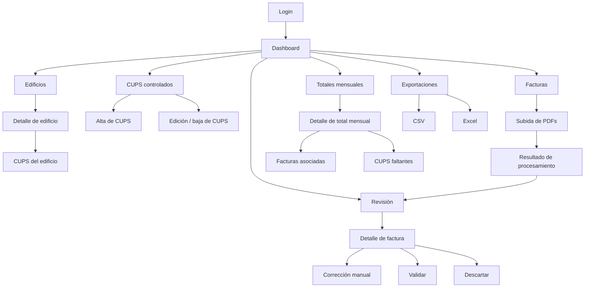
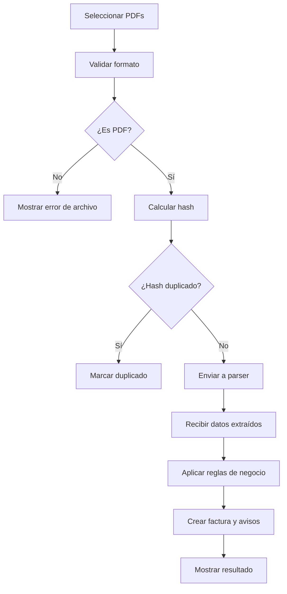
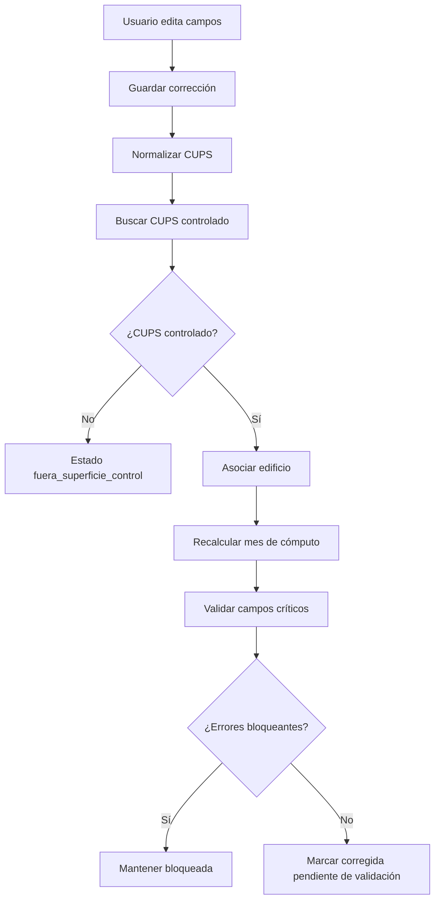
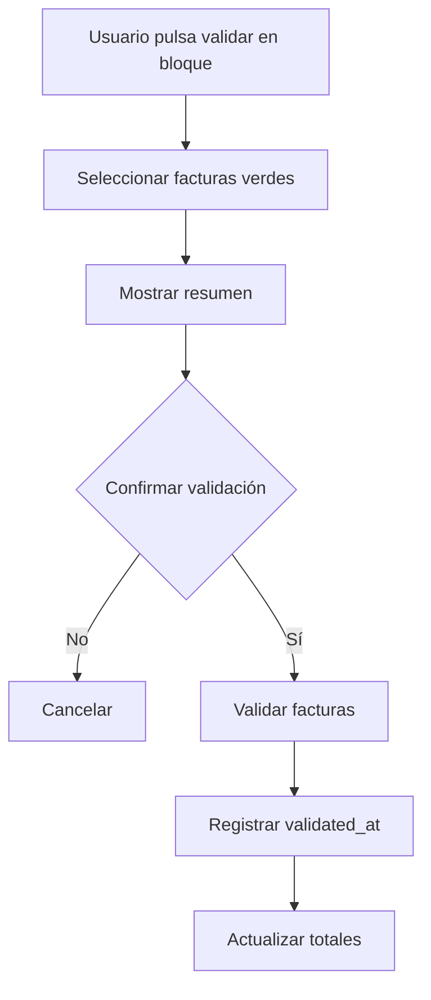
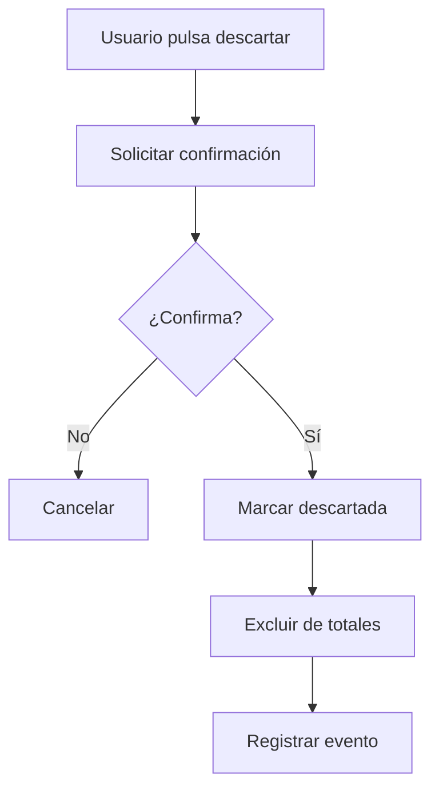
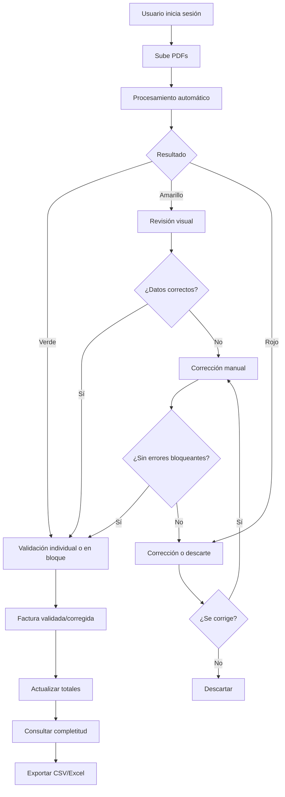
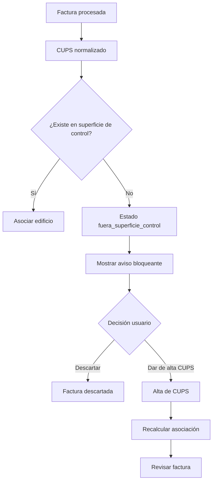
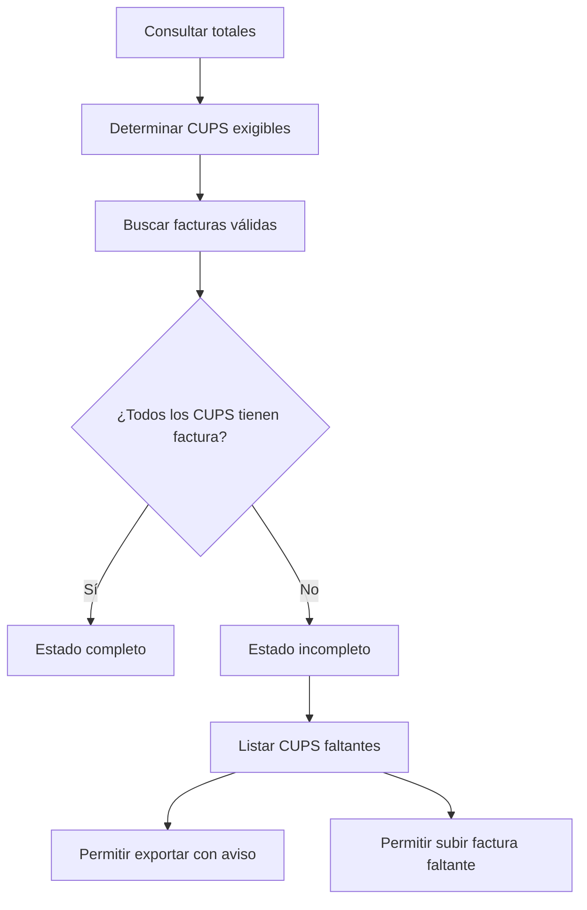

# Pantallas y flujos

## 1. Propósito del documento

Este documento define las pantallas principales y los flujos de uso del MVP de la aplicación auxiliar para la preparación de datos energéticos destinados a carga manual en SIGEE-AGE.

Su finalidad es convertir los requisitos funcionales y reglas de negocio en una estructura navegable y operativa para el usuario gestor.

Este documento debe servir como referencia para:

* diseño UX/UI;
* implementación frontend;
* validación funcional;
* pruebas de aceptación;
* planificación de tareas en OpenCode.

## 2. Principios de diseño funcional

La interfaz debe priorizar:

* claridad sobre sofisticación visual;
* revisión rápida de facturas procesadas;
* identificación inmediata de incidencias;
* trazabilidad entre facturas, CUPS, edificio y total mensual;
* reducción de pasos manuales;
* posibilidad de corregir sin romper reglas de negocio;
* exportación sencilla de resultados.

El usuario principal es un gestor que necesita preparar datos fiables para SIGEE-AGE, no analizar grandes volúmenes con reporting avanzado.

## 3. Mapa general de navegación



## 4. Pantallas del MVP

Pantallas mínimas previstas:

| Código | Pantalla                 | Finalidad                                 |
| ------ | ------------------------ | ----------------------------------------- |
| P-001  | Login                    | Acceso autenticado                        |
| P-010  | Dashboard                | Resumen operativo                         |
| P-020  | Edificios                | Consulta de edificios controlados         |
| P-021  | Detalle de edificio      | Consulta de CUPS y fuentes de un edificio |
| P-030  | CUPS controlados         | Mantenimiento de superficie de control    |
| P-031  | Alta de CUPS             | Incorporación de nuevo CUPS controlado    |
| P-032  | Edición / baja de CUPS   | Corrección o cierre de vigencia           |
| P-040  | Facturas                 | Entrada principal de facturas             |
| P-041  | Subida de PDFs           | Carga individual o múltiple               |
| P-050  | Revisión de facturas     | Validación, corrección y descarte         |
| P-051  | Detalle de factura       | Revisión visual de una factura            |
| P-060  | Totales mensuales        | Consulta de resultados consolidados       |
| P-061  | Detalle de total mensual | Facturas usadas y CUPS faltantes          |
| P-070  | Exportaciones            | Descarga CSV/Excel                        |

## 5. P-001 Login

### 5.1 Objetivo

Permitir el acceso seguro a la aplicación mediante email y contraseña.

### 5.2 Elementos de pantalla

* campo email;
* campo contraseña;
* botón iniciar sesión;
* mensaje de error si las credenciales no son válidas.

### 5.3 Reglas

* las pantallas internas requieren sesión iniciada;
* si la sesión expira, el usuario debe volver a autenticarse;
* no se muestran opciones avanzadas de roles en el MVP.

### 5.4 Estados posibles

| Estado                 | Comportamiento       |
| ---------------------- | -------------------- |
| Sin sesión             | Muestra login        |
| Credenciales válidas   | Redirige a dashboard |
| Credenciales inválidas | Muestra error        |
| Sesión expirada        | Redirige a login     |

## 6. P-010 Dashboard

### 6.1 Objetivo

Ofrecer una visión rápida del estado del trabajo pendiente.

### 6.2 Información recomendada

Tarjetas o bloques:

* facturas pendientes de validación;
* facturas con errores bloqueantes;
* facturas listas para validación en bloque;
* meses incompletos;
* CUPS fuera de superficie detectados;
* acceso rápido a subida de PDFs;
* acceso rápido a totales mensuales.

### 6.3 Acciones principales

* subir facturas;
* ir a revisión;
* consultar totales;
* revisar CUPS controlados.

### 6.4 Criterio MVP

El dashboard puede ser sencillo. No debe convertirse en un módulo analítico avanzado.

## 7. P-020 Edificios

### 7.1 Objetivo

Mostrar los edificios incluidos en la superficie de control.

### 7.2 Columnas recomendadas

| Campo               | Descripción                        |
| ------------------- | ---------------------------------- |
| Nombre              | Nombre visible del edificio        |
| Código interno      | `building_key`                     |
| Municipio           | Si se conoce                       |
| Provincia           | Si se conoce                       |
| Fuentes energéticas | Electricidad, gas natural, gasóleo |
| Nº CUPS activos     | CUPS vigentes asociados            |
| Estado              | Activo/inactivo                    |

### 7.3 Filtros

* texto libre por nombre;
* fuente energética;
* estado.

### 7.4 Acciones

* ver detalle del edificio;
* ver CUPS asociados;
* ir a totales filtrados por edificio.

## 8. P-021 Detalle de edificio

### 8.1 Objetivo

Consultar la información de un edificio y sus CUPS asociados.

### 8.2 Bloques de información

* datos generales del edificio;
* fuentes energéticas asociadas;
* CUPS eléctricos;
* CUPS de gas natural;
* previsión de gasóleo si aplica;
* últimas facturas validadas si se considera útil;
* estado de completitud reciente.

### 8.3 Tabla de CUPS del edificio

Columnas recomendadas:

| Campo            | Descripción                         |
| ---------------- | ----------------------------------- |
| Fuente           | Electricidad, gas natural o gasóleo |
| CUPS             | CUPS visible                        |
| CUPS normalizado | Clave de comparación                |
| Estado           | Activo/baja/pendiente               |
| Desde            | Primer mes controlado               |
| Hasta            | Último mes controlado si existe     |
| Descripción      | Observaciones o ubicación           |

### 8.4 Acciones

* alta de CUPS para ese edificio;
* editar CUPS;
* dar de baja CUPS;
* consultar totales del edificio.

## 9. P-030 CUPS controlados

### 9.1 Objetivo

Mantener la superficie de control que determina qué facturas se esperan y cómo se asocian a edificios.

### 9.2 Columnas recomendadas

| Campo                 | Descripción                   |
| --------------------- | ----------------------------- |
| Edificio              | Edificio asociado             |
| Fuente                | Fuente energética             |
| CUPS original         | Valor visible o introducido   |
| CUPS normalizado      | Clave interna                 |
| Estado                | Activo/baja/pendiente         |
| Primer mes controlado | Inicio de exigibilidad        |
| Último mes controlado | Fin de exigibilidad si existe |
| Suministrador         | Si se conoce                  |
| Tarifa                | Si se conoce                  |
| Observaciones         | Texto opcional                |

### 9.3 Filtros

* edificio;
* fuente energética;
* estado;
* texto libre por CUPS;
* CUPS activos o históricos.

### 9.4 Acciones

* crear CUPS;
* editar CUPS;
* dar de baja;
* consultar facturas asociadas;
* consultar totales asociados.

### 9.5 Reglas visuales

* CUPS activos: visibles como superficie de control vigente;
* CUPS dados de baja: visibles con marca histórica;
* CUPS pendientes: visibles con aviso de confirmación.

## 10. P-031 Alta de CUPS

### 10.1 Objetivo

Permitir incorporar un nuevo CUPS controlado cuando proceda.

### 10.2 Campos

| Campo                  | Tipo     | Obligatorio |
| ---------------------- | -------- | ----------- |
| Edificio               | Selector | Sí          |
| Fuente energética      | Selector | Sí          |
| CUPS original          | Texto    | Sí          |
| Primer mes a controlar | Mes/año  | Sí          |
| Estado                 | Selector | Sí          |
| Descripción            | Texto    | No          |
| Suministrador          | Texto    | No          |
| Tarifa                 | Texto    | No          |
| Observaciones          | Texto    | No          |

### 10.3 Comportamiento

Al introducir el CUPS original:

1. se normaliza automáticamente;
2. se muestra el CUPS normalizado;
3. se comprueba si ya existe;
4. se bloquea el guardado si existe duplicado incompatible.

### 10.4 Validaciones

* CUPS obligatorio;
* edificio obligatorio;
* fuente obligatoria;
* mes de inicio obligatorio;
* no duplicar `cups_key + energy_type_code`;
* mostrar aviso si el CUPS tiene formato dudoso.

### 10.5 Resultado

Al guardar:

* se crea el CUPS controlado;
* queda exigible desde el primer mes indicado;
* se registra evento de auditoría básica.

## 11. P-032 Edición / baja de CUPS

### 11.1 Objetivo

Permitir modificar datos no críticos y gestionar bajas de CUPS mediante vigencias.

### 11.2 Edición permitida

Campos editables recomendados:

* descripción;
* suministrador;
* tarifa;
* observaciones;
* primer mes a controlar si no genera incoherencias;
* último mes a controlar.

### 11.3 Baja de CUPS

La baja se realiza indicando:

* último mes a controlar;
* observación o motivo opcional.

### 11.4 Reglas

* no se borra físicamente un CUPS con histórico;
* desde el mes posterior al último mes controlado deja de exigirse;
* las facturas anteriores siguen asociadas;
* si llegan facturas posteriores a la baja, deben generar aviso.

### 11.5 Avisos

* “Este CUPS tiene facturas asociadas. No se eliminará, solo se cerrará su vigencia.”
* “Cambiar la vigencia puede afectar a la completitud de meses ya calculados.”

## 12. P-040 Facturas

### 12.1 Objetivo

Ser la entrada principal para gestionar facturas subidas y su estado.

### 12.2 Vista general

Debe mostrar un listado de facturas procesadas o pendientes.

Columnas recomendadas:

| Campo        | Descripción         |
| ------------ | ------------------- |
| Fecha subida | Fecha de carga      |
| Archivo      | Nombre original     |
| Estado       | Estado de factura   |
| Semáforo     | Verde/amarillo/rojo |
| Parser       | Parser usado        |
| Edificio     | Derivado del CUPS   |
| Fuente       | Fuente energética   |
| CUPS         | CUPS normalizado    |
| Periodo      | Inicio-fin          |
| Mes cómputo  | Año-mes             |
| Consumo      | kWh                 |
| Importe      | Total con IVA       |
| Avisos       | Resumen             |

### 12.3 Filtros

* estado;
* semáforo;
* edificio;
* fuente;
* mes de cómputo;
* parser;
* CUPS;
* texto por número de factura o archivo.

### 12.4 Acciones

* subir PDFs;
* abrir revisión;
* validar si procede;
* descartar;
* filtrar facturas problemáticas;
* ir a detalle.

## 13. P-041 Subida de PDFs

### 13.1 Objetivo

Permitir subir una o varias facturas PDF.

### 13.2 Elementos

* zona de arrastre o selector de archivos;
* lista de archivos seleccionados;
* botón procesar;
* progreso por archivo;
* resultado por archivo.

### 13.3 Flujo



### 13.4 Resultado de procesamiento

Por cada archivo debe mostrarse:

* nombre;
* estado técnico;
* parser detectado;
* estado de factura;
* semáforo;
* avisos principales;
* acción recomendada.

### 13.5 Acciones tras procesar

* ir a revisión;
* validar todas las facturas verdes;
* revisar facturas amarillas;
* corregir o descartar facturas rojas.

## 14. P-050 Revisión de facturas

### 14.1 Objetivo

Permitir revisar, corregir, validar o descartar facturas procesadas.

Esta es una de las pantallas centrales del MVP.

### 14.2 Diseño recomendado

Diseño en dos zonas:

* izquierda: tabla de facturas;
* derecha: detalle de factura seleccionada y visor PDF si está disponible.

Alternativa para pantallas pequeñas:

* listado de facturas;
* detalle en página independiente o panel desplegable.

### 14.3 Tabla de revisión

Columnas recomendadas:

| Campo           | Descripción            |
| --------------- | ---------------------- |
| Semáforo        | Verde, amarillo o rojo |
| Estado          | Estado de factura      |
| Archivo/factura | Nombre o número        |
| Parser          | Parser utilizado       |
| Edificio        | Asociado por CUPS      |
| Fuente          | Tipo energético        |
| CUPS            | Normalizado            |
| Periodo         | Inicio-fin             |
| Mes             | Mes de cómputo         |
| Consumo         | kWh                    |
| Importe         | Total con IVA          |
| Avisos          | Nº o resumen           |

### 14.4 Acciones disponibles

| Acción            | Condición                                        |
| ----------------- | ------------------------------------------------ |
| Validar           | Sin errores bloqueantes                          |
| Validar en bloque | Solo facturas verdes                             |
| Corregir          | Facturas pendientes, amarillas o rojas           |
| Descartar         | Cualquier factura no consolidada definitivamente |
| Ver PDF           | Si el PDF está disponible                        |
| Ver avisos        | Siempre que existan avisos                       |

### 14.5 Semáforo

| Color    | Significado              | Acción esperada                           |
| -------- | ------------------------ | ----------------------------------------- |
| Verde    | Lista para validación    | Validar individual o en bloque            |
| Amarillo | Requiere revisión visual | Abrir detalle, confirmar o corregir       |
| Rojo     | Bloqueada                | Corregir datos, sustituir PDF o descartar |

## 15. P-051 Detalle de factura

### 15.1 Objetivo

Mostrar toda la información necesaria para decidir si una factura puede validarse.

### 15.2 Bloques

#### Datos del archivo

* nombre original;
* fecha de subida;
* hash;
* estado técnico;
* disponibilidad del PDF.

#### Datos extraídos

* parser;
* confianza;
* comercializadora;
* número de factura;
* CUPS original;
* CUPS normalizado;
* fuente energética;
* periodo;
* consumo;
* importe total.

#### Datos finales

* CUPS final;
* edificio derivado;
* fuente final;
* periodo final;
* mes y año de cómputo;
* consumo final;
* importe final;
* estado.

#### Avisos

* código;
* nivel;
* mensaje;
* campo afectado;
* bloqueante sí/no.

#### Visor PDF

* panel o enlace seguro para abrir PDF;
* aviso si el PDF ya no está disponible.

### 15.3 Acciones

* validar;
* corregir;
* guardar corrección;
* descartar;
* volver al listado.

## 16. Corrección manual de factura

### 16.1 Objetivo

Permitir al usuario corregir datos extraídos o completar datos ausentes.

### 16.2 Campos editables

| Campo                 | Regla                                             |
| --------------------- | ------------------------------------------------- |
| CUPS original         | Recalcula CUPS normalizado y edificio             |
| Fuente energética     | Revalida compatibilidad con CUPS                  |
| Fecha inicio          | Debe ser fecha válida                             |
| Fecha cierre          | Recalcula año y mes de cómputo                    |
| Consumo kWh           | Decimal mayor o igual que cero, con aviso si cero |
| Importe total con IVA | Decimal, aviso si cero o negativo                 |
| Número de factura     | Recomendado, no siempre bloqueante                |
| Comercializadora      | Recomendado                                       |

### 16.3 Campos no editables directamente

* edificio;
* CUPS normalizado;
* año de cómputo;
* mes de cómputo;
* estado de superficie de control.

Estos campos se recalculan automáticamente.

### 16.4 Flujo de corrección



### 16.5 Trazabilidad

Cuando se corrige una factura:

* se conservan valores extraídos originales;
* se guardan valores finales corregidos;
* se marca que la factura fue corregida;
* se registra evento de auditoría básica si se implementa.

## 17. Validación individual

### 17.1 Objetivo

Confirmar una factura para que entre en totales.

### 17.2 Condiciones

Una factura puede validarse individualmente si:

* no tiene avisos bloqueantes;
* tiene campos críticos completos;
* el CUPS está controlado;
* la fuente energética es compatible;
* no es duplicado exacto;
* el usuario confirma los datos.

### 17.3 Resultado

* si no hubo cambios: estado `validada`;
* si hubo corrección: estado `corregida`;
* se registra fecha de validación;
* entra en totales.

## 18. Validación en bloque

### 18.1 Objetivo

Reducir trabajo manual validando múltiples facturas sin incidencias.

### 18.2 Condiciones

Solo son seleccionables para validación en bloque las facturas verdes.

Condiciones:

* parser específico;
* confianza alta;
* CUPS controlado;
* fuente compatible;
* campos críticos completos;
* sin avisos amarillos ni rojos;
* no duplicada;
* no manual;
* no parser genérico.

### 18.3 Flujo



### 18.4 Resumen previo recomendado

Antes de confirmar:

* número de facturas a validar;
* edificios afectados;
* fuentes afectadas;
* meses afectados;
* advertencia de que solo entrarán facturas sin incidencias.

## 19. Descarte de factura

### 19.1 Objetivo

Permitir excluir una factura que no debe alimentar totales.

### 19.2 Casos típicos

* CUPS no controlado y no procede alta;
* factura ajena al ámbito;
* PDF incorrecto;
* duplicado no detectado automáticamente;
* documento que no es factura energética válida.

### 19.3 Flujo



### 19.4 Reglas

* una factura descartada no entra en totales;
* debe poder consultarse posteriormente;
* no se elimina necesariamente el registro técnico.

## 20. P-060 Totales mensuales

### 20.1 Objetivo

Mostrar los resultados consolidados por edificio, fuente energética, año y mes.

### 20.2 Columnas mínimas

| Campo               | Descripción                        |
| ------------------- | ---------------------------------- |
| Edificio            | Nombre visible                     |
| Fuente energética   | Electricidad, gas natural, gasóleo |
| Año                 | Año de cómputo                     |
| Mes                 | Mes de cómputo                     |
| Consumo total kWh   | Suma de facturas válidas           |
| Gasto total con IVA | Suma de importes válidos           |
| CUPS exigibles      | Nº de CUPS esperados               |
| CUPS cubiertos      | Nº de CUPS con factura válida      |
| CUPS faltantes      | Nº de CUPS sin factura válida      |
| Estado              | Completo, incompleto o sin datos   |
| Avisos              | Resumen                            |

### 20.3 Filtros

* año;
* mes o rango de meses;
* edificio;
* fuente energética;
* estado de completitud.

### 20.4 Acciones

* ver detalle;
* exportar resumen;
* ir a revisión filtrada;
* consultar CUPS faltantes.

### 20.5 Reglas visuales

| Estado     | Representación sugerida        |
| ---------- | ------------------------------ |
| Completo   | Indicador positivo             |
| Incompleto | Aviso amarillo                 |
| Sin datos  | Aviso rojo o gris según diseño |

No se debe ocultar un total por estar incompleto. Debe mostrarse con aviso.

## 21. P-061 Detalle de total mensual

### 21.1 Objetivo

Permitir verificar qué facturas y CUPS componen un total mensual.

### 21.2 Bloques

#### Resumen

* edificio;
* fuente;
* año;
* mes;
* consumo total;
* gasto total;
* estado de completitud.

#### CUPS exigibles

Tabla con:

* CUPS;
* descripción;
* estado de vigencia;
* facturas válidas encontradas;
* consumo total por CUPS;
* importe total por CUPS;
* estado cubierto/faltante.

#### Facturas asociadas

Tabla con:

* número de factura;
* comercializadora;
* CUPS;
* periodo;
* consumo;
* importe;
* estado;
* parser.

#### CUPS faltantes

Listado específico de CUPS exigibles sin factura válida.

### 21.3 Acciones

* ir a revisión de facturas de ese mes;
* subir factura faltante;
* consultar o editar CUPS;
* exportar detalle.

## 22. P-070 Exportaciones

### 22.1 Objetivo

Permitir descargar los datos preparados para revisión o carga manual en SIGEE-AGE.

### 22.2 Tipos de exportación

| Tipo                     | Formato   | Estado MVP   |
| ------------------------ | --------- | ------------ |
| Resumen mensual          | CSV       | MVP          |
| Resumen mensual          | Excel     | MVP          |
| Detalle por factura/CUPS | CSV/Excel | MVP deseable |

### 22.3 Parámetros

* rango de meses;
* edificio opcional;
* fuente opcional;
* estado de completitud opcional;
* incluir avisos sí/no;
* incluir detalle sí/no si se implementa.

### 22.4 Reglas

* los totales incompletos pueden exportarse, pero deben quedar marcados;
* los importes deben corresponder al total con IVA incluido;
* solo se exportan facturas validadas o corregidas en cálculos de totales;
* las facturas pendientes o descartadas pueden aparecer solo en exportación de detalle si se solicita.

## 23. Flujo completo principal



## 24. Flujo de CUPS no controlado



## 25. Flujo de mes incompleto



## 26. Estados visuales de factura

| Estado                     | Visualización recomendada     | Acción principal         |
| -------------------------- | ----------------------------- | ------------------------ |
| `pendiente_validacion`     | Amarillo o neutro             | Revisar/validar          |
| `validada`                 | Verde                         | Consultar                |
| `corregida`                | Verde con marca de corrección | Consultar                |
| `fuera_superficie_control` | Rojo                          | Descartar o alta CUPS    |
| `error_parseo`             | Rojo                          | Carga manual o descartar |
| `requiere_carga_manual`    | Rojo/amarillo                 | Completar datos          |
| `duplicada`                | Rojo o gris                   | Consultar duplicado      |
| `descartada`               | Gris                          | Consultar histórico      |

## 27. Estados visuales de completitud

| Estado       | Significado                                    | Acción sugerida                    |
| ------------ | ---------------------------------------------- | ---------------------------------- |
| `completo`   | Todos los CUPS exigibles tienen factura válida | Exportar o revisar detalle         |
| `incompleto` | Faltan una o más facturas                      | Revisar CUPS faltantes             |
| `sin_datos`  | No hay facturas válidas para el periodo        | Subir facturas o revisar vigencias |

## 28. Mensajes recomendados

### 28.1 Factura verde

```txt
Sin incidencias. Factura lista para validación.
```

### 28.2 Factura amarilla

```txt
Requiere revisión visual antes de validar. Abre el PDF y confirma los datos extraídos.
```

### 28.3 Factura roja

```txt
No se puede validar. Corrige los datos, sustituye el PDF o descarta la factura.
```

### 28.4 CUPS no controlado

```txt
El CUPS de esta factura no pertenece a la superficie de control. La factura no entrará en totales salvo que des de alta el CUPS.
```

### 28.5 Mes incompleto

```txt
El periodo tiene CUPS exigibles sin factura válida. El total se muestra como parcial.
```

### 28.6 Duplicado

```txt
Factura duplicada. Ya existe en el sistema y no se procesará de nuevo.
```

## 29. Requisitos de usabilidad

### 29.1 Claridad

Cada factura debe mostrar claramente:

* qué se ha detectado;
* qué falta;
* qué acción debe realizar el usuario.

### 29.2 No ocultar información relevante

Los totales incompletos deben mostrarse. Ocultarlos podría inducir a pensar que no existe consumo o gasto.

### 29.3 Edición controlada

El usuario puede corregir datos críticos, pero la aplicación debe recalcular automáticamente campos derivados.

### 29.4 Trazabilidad visible

Debe poder saberse qué facturas justifican cada total mensual.

### 29.5 Carga múltiple práctica

La subida múltiple debe permitir procesar varias facturas sin que el error de una bloquee el resto.

## 30. Criterios de aceptación de pantallas

El bloque de pantallas y flujos se considera válido si:

1. El usuario puede iniciar sesión.
2. Puede consultar edificios y CUPS controlados.
3. Puede subir PDFs individualmente y en lote.
4. Puede ver el resultado de procesamiento por factura.
5. Puede revisar facturas con semáforo y avisos.
6. Puede corregir campos críticos.
7. Puede validar individualmente.
8. Puede validar en bloque solo facturas verdes.
9. Puede descartar facturas.
10. Puede consultar totales mensuales.
11. Puede ver CUPS faltantes en meses incompletos.
12. Puede exportar resumen a CSV y Excel.
13. Puede consultar el detalle que justifica cada total.

## 31. Relación con otros documentos

Este documento se apoya especialmente en:

* `02_alcance_mvp.md`;
* `03_requisitos_funcionales.md`;
* `04_reglas_negocio.md`;
* `05_modelo_datos.md`;
* `06_arquitectura_tecnica.md`;
* `08_parsers_facturas.md`;
* `09_validaciones_y_avisos.md`;
* `10_exportaciones.md`.

## 32. Pendientes

TODO: Definir wireframes visuales si se decide añadir una capa de diseño más concreta.

TODO: Confirmar si el detalle de factura se mostrará en panel lateral o página completa.

TODO: Definir textos finales de botones y acciones.

TODO: Confirmar formato exacto de mes/año en tablas y exportaciones.

TODO: Confirmar si la exportación se lanza desde la tabla de totales, desde pantalla específica o ambas.

TODO: Validar con usuario gestor el orden definitivo de columnas en revisión y totales.
